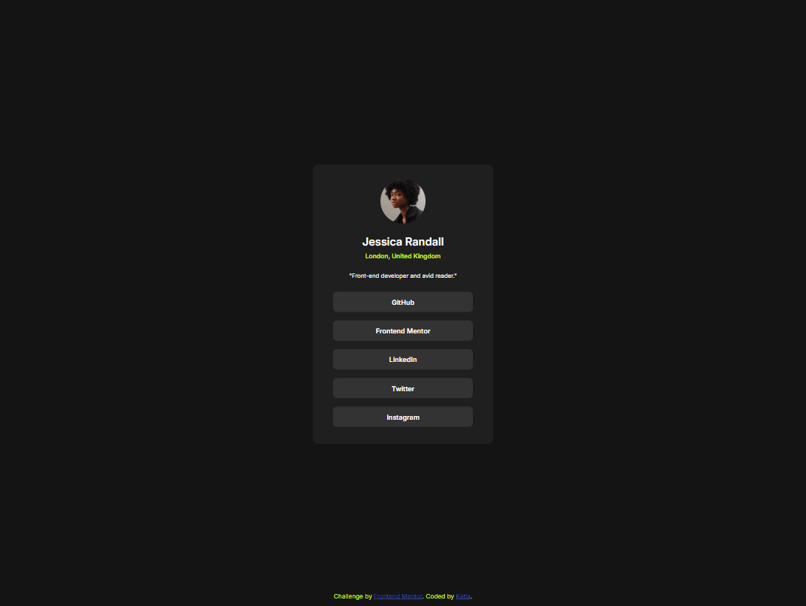
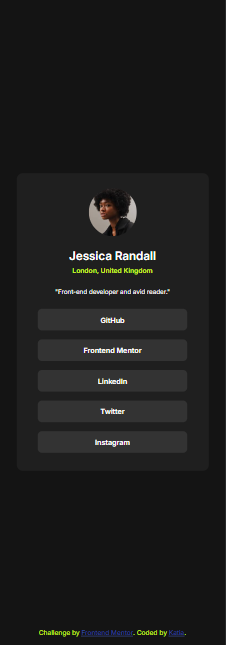
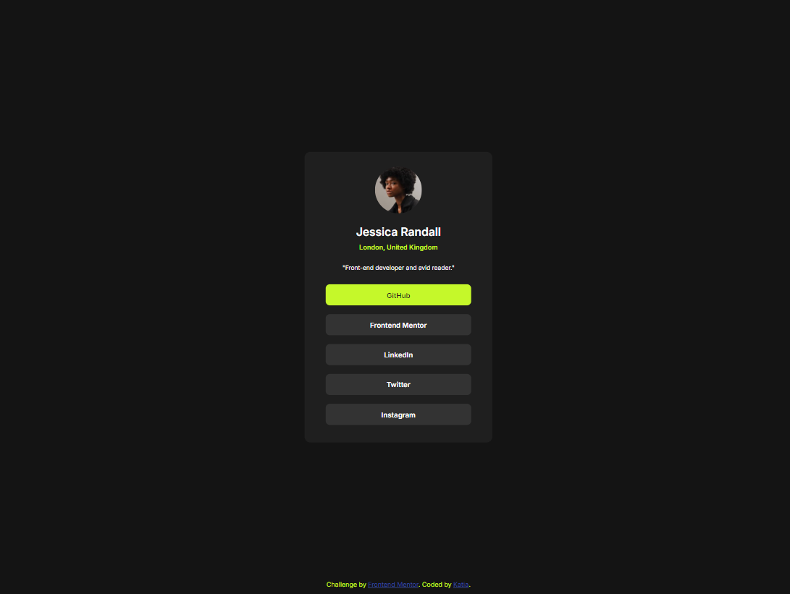

# Frontend Mentor - Social links profile solution

This is a solution to the [Social links profile challenge on Frontend Mentor](https://www.frontendmentor.io/challenges/social-links-profile-UG32l9m6dQ). Frontend Mentor challenges help you improve your coding skills by building realistic projects. 

## Table of contents

- [Overview](#overview)
  - [The challenge](#the-challenge)
  - [Screenshot](#screenshot)
- [My process](#my-process)
  - [Built with](#built-with)

## Overview

This page is a social media link block, the buttons will hover when the mouse passes over it or click it. 

### The challenge

Users should be able to:

- See hover and focus states for all interactive elements on the page

### Screenshot

## My process

I started with the box that contains the flexboxes, I found difficult to center the item's text, since I didn't remember that you can put a flexbox inside another flexbox, but after I made my research I could overcome the challenge and everything fall into place. 
I have to keep practicing so I'ld be able to finish little projects like this in no time. 

### Built with

- Semantic HTML5 markup
- CSS custom properties
- Flexbox
